# SpringBoot Docker based microservices - Azure Devops integration

Sample Spring boot Microservice - Azure Devops integration. Azure pipeline will build docker image and push to azure container registry. For each commit - it will build/test/push. This is an example of Continuous integration

----

Using tools like Jenkins does not means you follow CI/CD. 
_Continuous Integration (CI) is a development practice where developers integrate code into a shared repository frequently, preferably several times a day. Each integration can then be verified by an automated build and automated tests._**

Mostly we follow below flow for CI
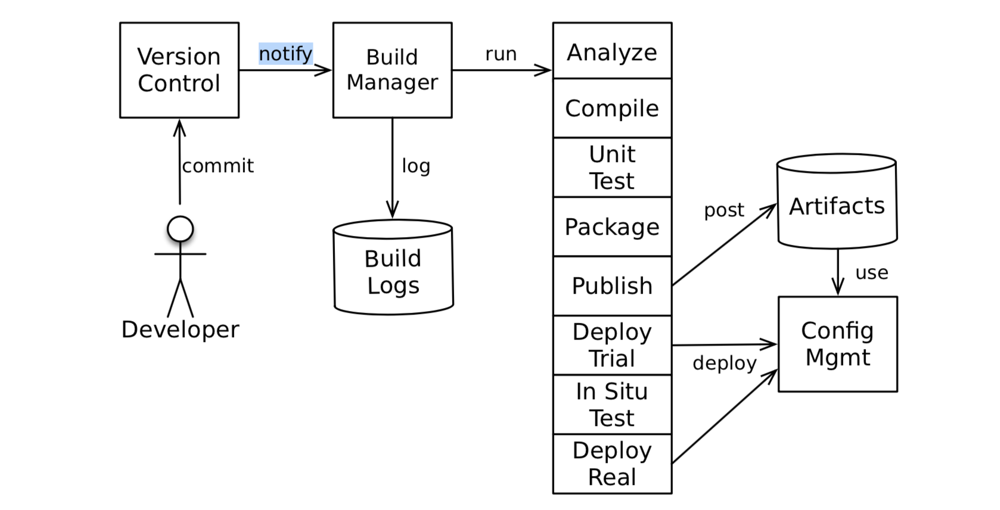
*Above image copied from "Release It! Design and Deploy by Michael Nygard"*

---- 
----
### Create Azure Devops Projects
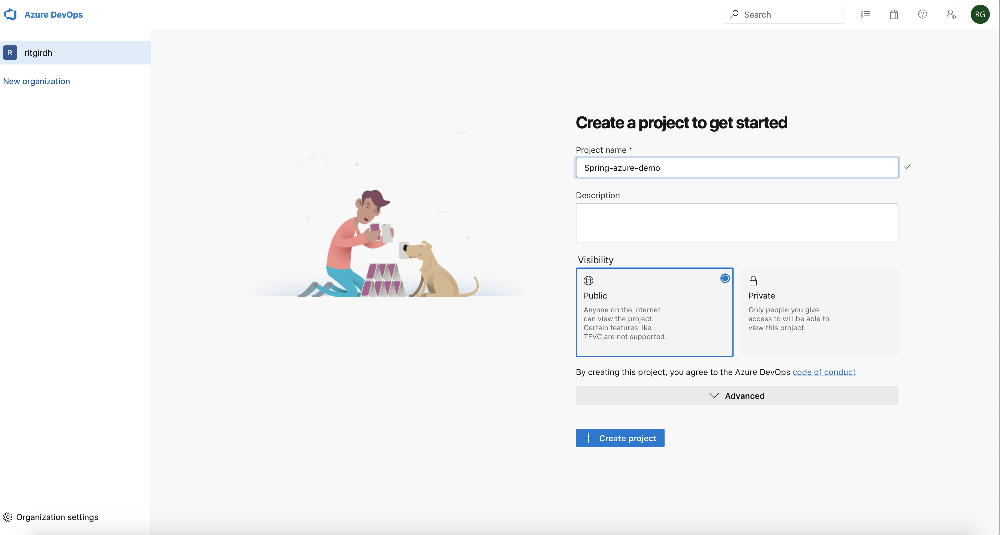
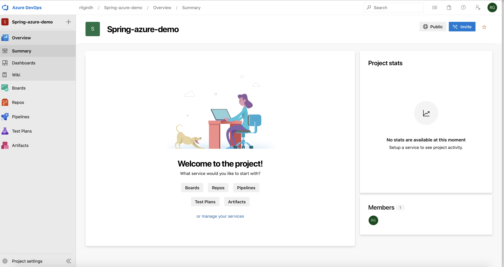
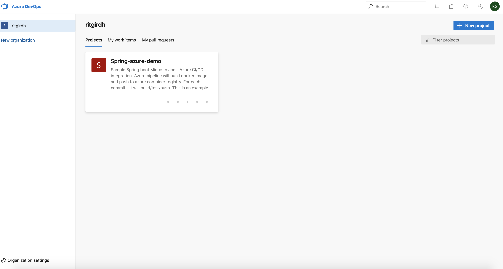
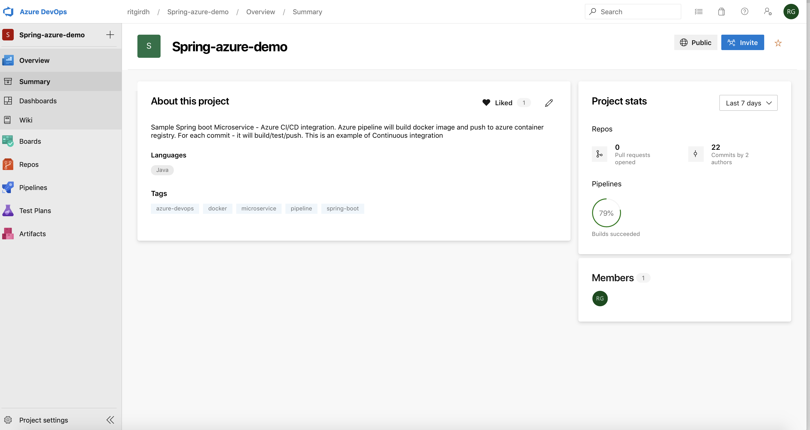

---- 

### Create Git repository or clone it from existing repo
(Refer below section for cloning)
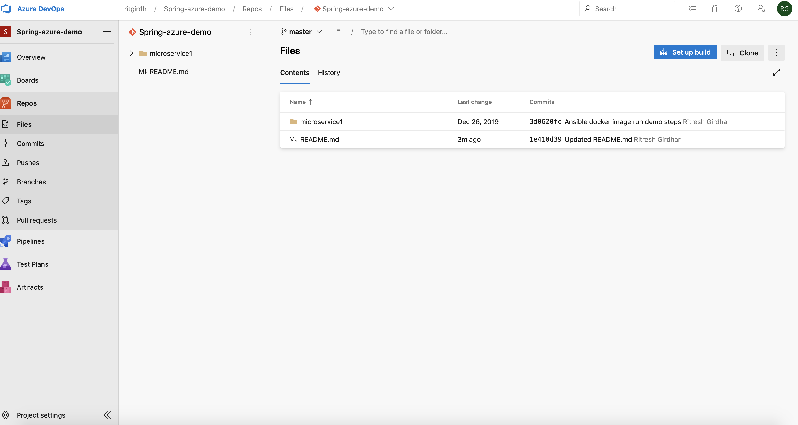
```
|
`-- microservice1
    |-- Dockerfile
    |-- pom.xml
    `-- src
        |-- main
        |   |-- java
        |   |   `-- edu
        |   |       `-- sampleapplication
        |   |           `-- MS1
        |   |               |-- ApiController.java
        |   |               `-- Ms1Application.java
        |   `-- resources
        |       |-- application.properties
        |       `-- logback-spring.xml
        `-- test
            `-- java
                `-- edu
                    `-- sampleapplication
                        `-- MS1
                            `-- Ms1ApplicationTests.java

```

### Let's Set up build pipeline. Click "Set up Build button"
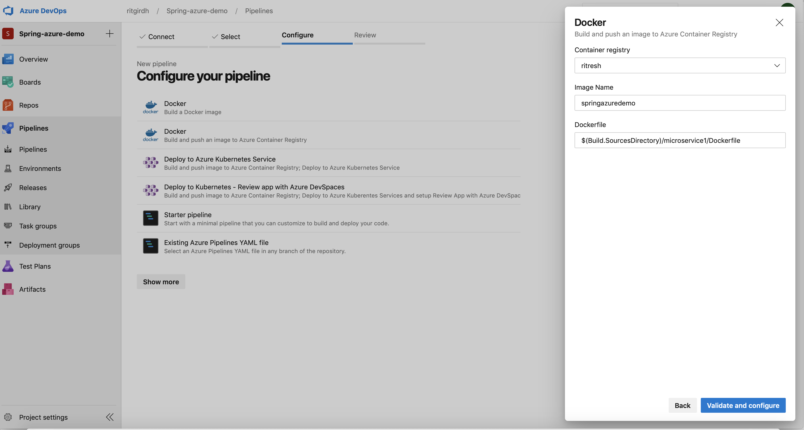
* Here we selected option to build docker image and push to azure container registry

### Let's Understand azure pipeline. 
* Default pipeline yaml file will contains build and push steps and tasks to build docker image and push to container registry. 
```
# Docker
# Build and push an image to Azure Container Registry
# https://docs.microsoft.com/azure/devops/pipelines/languages/docker

trigger:
- master

resources:
- repo: self

variables:
  # Container registry service connection established during pipeline creation
  dockerRegistryServiceConnection: '8eb2472c-86b9-4669-871b-9b9872670821'
  imageRepository: 'springazuredemo'
  containerRegistry: 'ritresh.azurecr.io'
  dockerfilePath: '$(Build.SourcesDirectory)/microservice1/Dockerfile'
  tag: '$(Build.BuildId)'
  
  # Agent VM image name
  vmImageName: 'ubuntu-latest'

stages:
- stage: Build
  displayName: Build and push stage
  jobs:  
  - job: Build
    displayName: Build
    pool:
      vmImage: $(vmImageName)
    steps:
    - task: Docker@2
      displayName: Build and push an image to container registry
      inputs:
        command: buildAndPush
        repository: $(imageRepository)
        dockerfile: $(dockerfilePath)
        containerRegistry: $(dockerRegistryServiceConnection)
        tags: |
          $(tag)

```

* But for our set up default conf will not work we need to add maven tasks to build spring boot application.
```
# Docker
# Build and push an image to Azure Container Registry
# https://docs.microsoft.com/azure/devops/pipelines/languages/docker

trigger:
- master

resources:
- repo: self

variables:
  # Container registry service connection established during pipeline creation
  dockerRegistryServiceConnection: 'c1a4b0b1-bbda-4066-810a-a3b646af911f'
  imageRepository: 'springazuredemo'
  containerRegistry: 'ritresh.azurecr.io'
  dockerfilePath: '$(Build.SourcesDirectory)/microservice1/Dockerfile'
  tag: '$(Build.BuildId)'
  
  # Agent VM image name
  vmImageName: 'ubuntu-latest'

stages:
- stage: Build
  displayName: Build and push stage
  jobs:  
  - job: Build
    displayName: Build
    pool:
      vmImage: $(vmImageName)
    steps:
    - task: Maven@3
      inputs:
        mavenPomFile: 'microservice1/pom.xml'
        mavenOptions: '-Xmx3072m'
        javaHomeOption: 'JDKVersion'
        jdkVersionOption: '1.8'
        jdkArchitectureOption: 'x64'
        publishJUnitResults: false
        goals: 'clean install'
    - task: Docker@2
      displayName: Build and push an image to container registry
      inputs:
        command: buildAndPush
        repository: $(imageRepository)
        dockerfile: $(dockerfilePath)
        containerRegistry: $(dockerRegistryServiceConnection)
        tags: |
          $(tag)
```

### Let's check Azure container registry.
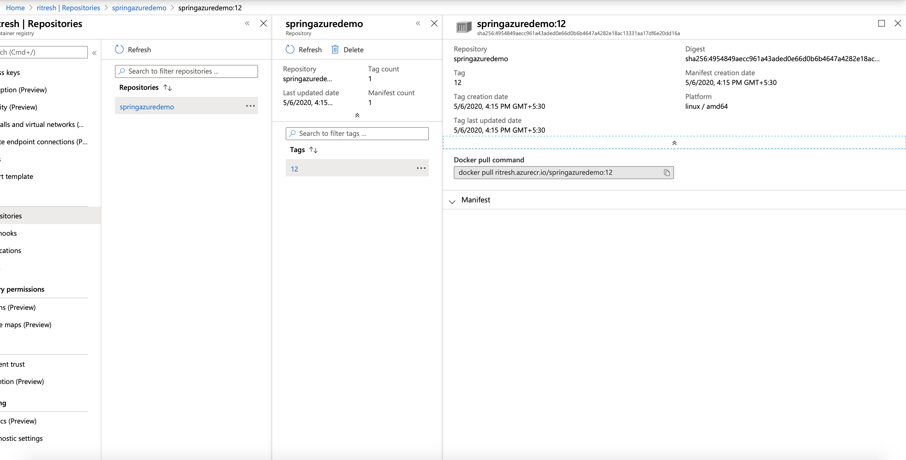
* Here you will find docker image under springazuredemo repository.


### Lets Run it on local environment 

```
WKMIN1307242:study ritgirdh$ docker login ritresh.azurecr.io
Username: ritresh
Password: 
Login Succeeded
WKMIN1307242:study ritgirdh$ docker pull ritresh.azurecr.io/springazuredemo:17
17: Pulling from springazuredemo
e7c96db7181b: Already exists 
f910a506b6cb: Already exists 
c2274a1a0e27: Already exists 
8b7b20a1fb06: Pull complete 
Digest: sha256:13f46fce6f2910c6fe84e9ff8459ab1a2973740df442717c99c79a9016fe1caa
Status: Downloaded newer image for ritresh.azurecr.io/springazuredemo:17
ritresh.azurecr.io/springazuredemo:17
WKMIN1307242:study ritgirdh$ docker run -p5555:8080 ritresh.azurecr.io/springazuredemo:17

  .   ____          _            __ _ _
 /\\ / ___'_ __ _ _(_)_ __  __ _ \ \ \ \
( ( )\___ | '_ | '_| | '_ \/ _` | \ \ \ \
 \\/  ___)| |_)| | | | | || (_| |  ) ) ) )
  '  |____| .__|_| |_|_| |_\__, | / / / /
 =========|_|==============|___/=/_/_/_/
 :: Spring Boot ::        (v2.0.0.RELEASE)

2020-05-06 11:55:45.969  INFO 1 --- [           main] e.sampleapplication.MS1.Ms1Application   : Starting Ms1Application v1.0.0-SNAPSHOT on 8c5ac374947d with PID 1 (/ms1.jar started by root in /)
2020-05-06 11:55:45.983  INFO 1 --- [           main] e.sampleapplication.MS1.Ms1Application   : No active profile set, falling back to default profiles: default
2020-05-06 11:55:46.086  INFO 1 --- [           main] ConfigServletWebServerApplicationContext : Refreshing org.springframework.boot.web.servlet.context.AnnotationConfigServletWebServerApplicationContext@38cccef: startup date [Wed May 06 11:55:46 GMT 2020]; root of context hierarchy
2020-05-06 11:55:48.285  INFO 1 --- [           main] o.s.b.w.embedded.tomcat.TomcatWebServer  : Tomcat initialized with port(s): 8080 (http)
2020-05-06 11:55:48.353  INFO 1 --- [           main] o.apache.catalina.core.StandardService   : Starting service [Tomcat]
2020-05-06 11:55:48.353  INFO 1 --- [           main] org.apache.catalina.core.StandardEngine  : Starting Servlet Engine: Apache Tomcat/8.5.28
2020-05-06 11:55:48.381  INFO 1 --- [ost-startStop-1] o.a.catalina.core.AprLifecycleListener   : The APR based Apache Tomcat Native library which allows optimal performance in production environments was not found on the java.library.path: [/usr/lib/jvm/java-1.8-openjdk/jre/lib/amd64/server:/usr/lib/jvm/java-1.8-openjdk/jre/lib/amd64:/usr/lib/jvm/java-1.8-openjdk/jre/../lib/amd64:/usr/java/packages/lib/amd64:/usr/lib64:/lib64:/lib:/usr/lib]
2020-05-06 11:55:48.579  INFO 1 --- [ost-startStop-1] o.a.c.c.C.[Tomcat].[localhost].[/]       : Initializing Spring embedded WebApplicationContext
2020-05-06 11:55:48.579  INFO 1 --- [ost-startStop-1] o.s.web.context.ContextLoader            : Root WebApplicationContext: initialization completed in 2499 ms
2020-05-06 11:55:49.257  INFO 1 --- [ost-startStop-1] o.s.b.w.servlet.ServletRegistrationBean  : Servlet dispatcherServlet mapped to [/]
2020-05-06 11:55:49.265  INFO 1 --- [ost-startStop-1] o.s.b.w.servlet.FilterRegistrationBean   : Mapping filter: 'characterEncodingFilter' to: [/*]
2020-05-06 11:55:49.265  INFO 1 --- [ost-startStop-1] o.s.b.w.servlet.FilterRegistrationBean   : Mapping filter: 'hiddenHttpMethodFilter' to: [/*]
2020-05-06 11:55:49.265  INFO 1 --- [ost-startStop-1] o.s.b.w.servlet.FilterRegistrationBean   : Mapping filter: 'httpPutFormContentFilter' to: [/*]
2020-05-06 11:55:49.266  INFO 1 --- [ost-startStop-1] o.s.b.w.servlet.FilterRegistrationBean   : Mapping filter: 'requestContextFilter' to: [/*]
2020-05-06 11:55:49.266  INFO 1 --- [ost-startStop-1] o.s.b.w.servlet.FilterRegistrationBean   : Mapping filter: 'httpTraceFilter' to: [/*]
2020-05-06 11:55:49.266  INFO 1 --- [ost-startStop-1] o.s.b.w.servlet.FilterRegistrationBean   : Mapping filter: 'webMvcMetricsFilter' to: [/*]
2020-05-06 11:55:49.792  INFO 1 --- [           main] s.w.s.m.m.a.RequestMappingHandlerAdapter : Looking for @ControllerAdvice: org.springframework.boot.web.servlet.context.AnnotationConfigServletWebServerApplicationContext@38cccef: startup date [Wed May 06 11:55:46 GMT 2020]; root of context hierarchy
2020-05-06 11:55:49.923  INFO 1 --- [           main] s.w.s.m.m.a.RequestMappingHandlerMapping : Mapped "{[/message]}" onto java.lang.String edu.sampleapplication.MS1.ApiController.getMessage()
2020-05-06 11:55:49.925  INFO 1 --- [           main] s.w.s.m.m.a.RequestMappingHandlerMapping : Mapped "{[/v1],methods=[GET]}" onto public java.lang.String edu.sampleapplication.MS1.ApiController.test()
2020-05-06 11:55:49.929  INFO 1 --- [           main] s.w.s.m.m.a.RequestMappingHandlerMapping : Mapped "{[/error],produces=[text/html]}" onto public org.springframework.web.servlet.ModelAndView org.springframework.boot.autoconfigure.web.servlet.error.BasicErrorController.errorHtml(javax.servlet.http.HttpServletRequest,javax.servlet.http.HttpServletResponse)
2020-05-06 11:55:49.930  INFO 1 --- [           main] s.w.s.m.m.a.RequestMappingHandlerMapping : Mapped "{[/error]}" onto public org.springframework.http.ResponseEntity<java.util.Map<java.lang.String, java.lang.Object>> org.springframework.boot.autoconfigure.web.servlet.error.BasicErrorController.error(javax.servlet.http.HttpServletRequest)
2020-05-06 11:55:50.015  INFO 1 --- [           main] o.s.w.s.handler.SimpleUrlHandlerMapping  : Mapped URL path [/webjars/**] onto handler of type [class org.springframework.web.servlet.resource.ResourceHttpRequestHandler]
2020-05-06 11:55:50.015  INFO 1 --- [           main] o.s.w.s.handler.SimpleUrlHandlerMapping  : Mapped URL path [/**] onto handler of type [class org.springframework.web.servlet.resource.ResourceHttpRequestHandler]
2020-05-06 11:55:50.095  INFO 1 --- [           main] o.s.w.s.handler.SimpleUrlHandlerMapping  : Mapped URL path [/**/favicon.ico] onto handler of type [class org.springframework.web.servlet.resource.ResourceHttpRequestHandler]
2020-05-06 11:55:50.938  INFO 1 --- [           main] o.s.j.e.a.AnnotationMBeanExporter        : Registering beans for JMX exposure on startup
2020-05-06 11:55:50.946  INFO 1 --- [           main] ConfigServletWebServerApplicationContext : Refreshing org.springframework.boot.web.servlet.context.AnnotationConfigServletWebServerApplicationContext@6c779568: startup date [Wed May 06 11:55:50 GMT 2020]; parent: org.springframework.boot.web.servlet.context.AnnotationConfigServletWebServerApplicationContext@38cccef
2020-05-06 11:55:51.012  INFO 1 --- [           main] o.s.b.f.s.DefaultListableBeanFactory     : Overriding bean definition for bean 'handlerExceptionResolver' with a different definition: replacing [Root bean: class [null]; scope=; abstract=false; lazyInit=false; autowireMode=3; dependencyCheck=0; autowireCandidate=true; primary=false; factoryBeanName=org.springframework.web.servlet.config.annotation.DelegatingWebMvcConfiguration; factoryMethodName=handlerExceptionResolver; initMethodName=null; destroyMethodName=(inferred); defined in class path resource [org/springframework/web/servlet/config/annotation/DelegatingWebMvcConfiguration.class]] with [Root bean: class [null]; scope=; abstract=false; lazyInit=false; autowireMode=3; dependencyCheck=0; autowireCandidate=true; primary=false; factoryBeanName=org.springframework.boot.actuate.autoconfigure.web.servlet.WebMvcEndpointChildContextConfiguration; factoryMethodName=compositeHandlerExceptionResolver; initMethodName=null; destroyMethodName=(inferred); defined in class path resource [org/springframework/boot/actuate/autoconfigure/web/servlet/WebMvcEndpointChildContextConfiguration.class]]
2020-05-06 11:55:51.097  INFO 1 --- [           main] o.s.b.w.embedded.tomcat.TomcatWebServer  : Tomcat initialized with port(s): 8001 (http)
2020-05-06 11:55:51.099  INFO 1 --- [           main] o.apache.catalina.core.StandardService   : Starting service [Tomcat]
2020-05-06 11:55:51.100  INFO 1 --- [           main] org.apache.catalina.core.StandardEngine  : Starting Servlet Engine: Apache Tomcat/8.5.28
2020-05-06 11:55:51.122  INFO 1 --- [ost-startStop-1] o.a.c.c.C.[Tomcat-1].[localhost].[/]     : Initializing Spring embedded WebApplicationContext
2020-05-06 11:55:51.123  INFO 1 --- [ost-startStop-1] o.s.web.context.ContextLoader            : Root WebApplicationContext: initialization completed in 177 ms
2020-05-06 11:55:51.180  INFO 1 --- [ost-startStop-1] o.s.b.w.servlet.ServletRegistrationBean  : Servlet dispatcherServlet mapped to [/]
2020-05-06 11:55:51.256  INFO 1 --- [           main] s.b.a.e.w.s.WebMvcEndpointHandlerMapping : Mapped "{[/actuator/health],methods=[GET],produces=[application/vnd.spring-boot.actuator.v2+json || application/json]}" onto public java.lang.Object org.springframework.boot.actuate.endpoint.web.servlet.AbstractWebMvcEndpointHandlerMapping$OperationHandler.handle(javax.servlet.http.HttpServletRequest,java.util.Map<java.lang.String, java.lang.String>)
2020-05-06 11:55:51.258  INFO 1 --- [           main] s.b.a.e.w.s.WebMvcEndpointHandlerMapping : Mapped "{[/actuator/info],methods=[GET],produces=[application/vnd.spring-boot.actuator.v2+json || application/json]}" onto public java.lang.Object org.springframework.boot.actuate.endpoint.web.servlet.AbstractWebMvcEndpointHandlerMapping$OperationHandler.handle(javax.servlet.http.HttpServletRequest,java.util.Map<java.lang.String, java.lang.String>)
2020-05-06 11:55:51.260  INFO 1 --- [           main] s.b.a.e.w.s.WebMvcEndpointHandlerMapping : Mapped "{[/actuator],methods=[GET],produces=[application/vnd.spring-boot.actuator.v2+json || application/json]}" onto protected java.util.Map<java.lang.String, java.util.Map<java.lang.String, org.springframework.boot.actuate.endpoint.web.Link>> org.springframework.boot.actuate.endpoint.web.servlet.WebMvcEndpointHandlerMapping.links(javax.servlet.http.HttpServletRequest,javax.servlet.http.HttpServletResponse)
2020-05-06 11:55:51.334  INFO 1 --- [           main] s.w.s.m.m.a.RequestMappingHandlerMapping : Mapped "{[/error]}" onto public java.util.Map<java.lang.String, java.lang.Object> org.springframework.boot.actuate.autoconfigure.web.servlet.ManagementErrorEndpoint.invoke(org.springframework.web.context.request.ServletWebRequest)
2020-05-06 11:55:51.342  INFO 1 --- [           main] o.s.w.s.handler.SimpleUrlHandlerMapping  : Mapped URL path [/webjars/**] onto handler of type [class org.springframework.web.servlet.resource.ResourceHttpRequestHandler]
2020-05-06 11:55:51.343  INFO 1 --- [           main] o.s.w.s.handler.SimpleUrlHandlerMapping  : Mapped URL path [/**] onto handler of type [class org.springframework.web.servlet.resource.ResourceHttpRequestHandler]
2020-05-06 11:55:51.377  INFO 1 --- [           main] s.w.s.m.m.a.RequestMappingHandlerAdapter : Looking for @ControllerAdvice: org.springframework.boot.web.servlet.context.AnnotationConfigServletWebServerApplicationContext@6c779568: startup date [Wed May 06 11:55:50 GMT 2020]; parent: org.springframework.boot.web.servlet.context.AnnotationConfigServletWebServerApplicationContext@38cccef
2020-05-06 11:55:51.585  INFO 1 --- [           main] o.s.b.w.embedded.tomcat.TomcatWebServer  : Tomcat started on port(s): 8001 (http) with context path ''
2020-05-06 11:55:51.615  INFO 1 --- [           main] o.s.b.w.embedded.tomcat.TomcatWebServer  : Tomcat started on port(s): 8080 (http) with context path ''
2020-05-06 11:55:51.619  INFO 1 --- [           main] e.sampleapplication.MS1.Ms1Application   : Started Ms1Application in 6.497 seconds (JVM running for 7.807)
```
* Test the application
```
curl -ivk localhost:5555/v1   
*   Trying 127.0.0.1...
* TCP_NODELAY set
* Connected to localhost (127.0.0.1) port 5555 (#0)
> GET /v1 HTTP/1.1
> Host: localhost:5555
> User-Agent: curl/7.54.0
> Accept: */*
> 
< HTTP/1.1 200 
HTTP/1.1 200 
< Content-Type: text/plain;charset=UTF-8
Content-Type: text/plain;charset=UTF-8
< Content-Length: 13
Content-Length: 13
< Date: Wed, 06 May 2020 11:58:35 GMT
Date: Wed, 06 May 2020 11:58:35 GMT

< 
* Connection #0 to host localhost left intact
OKHello world
```

----
## Clone existing repo from Github
Here we cloning existing github repo i.e https://github.com/RitreshGirdhar/SpringBoot-Docker-Ansible. (For this demo i deleted some of the files related to 
ansible which dont belong to this Azure-devops demo.)
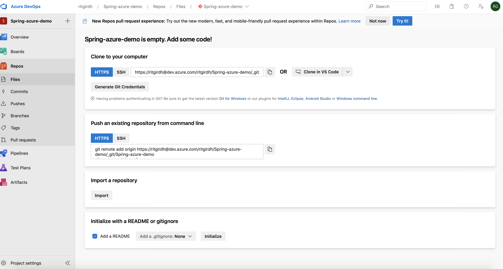
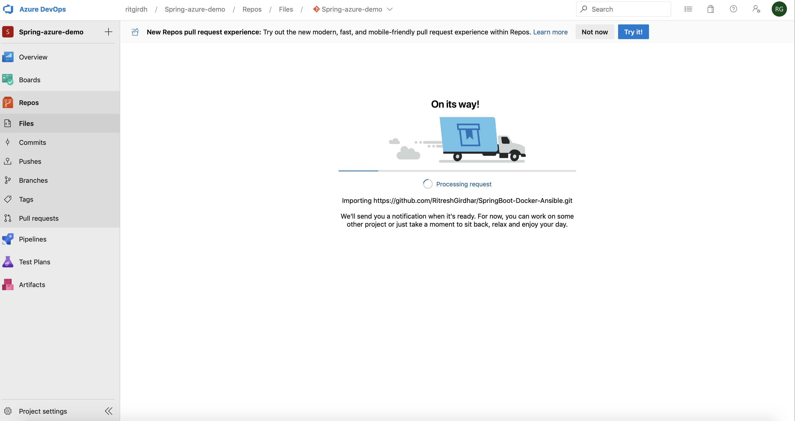
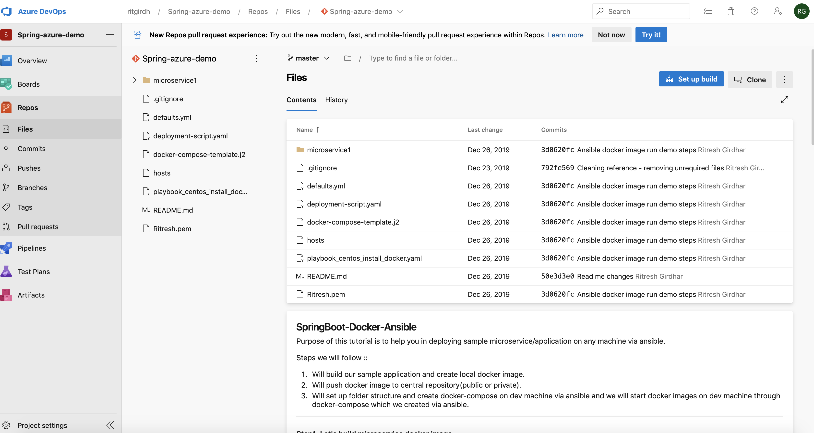


_This demo application's only purpose is to demonstrate the purpose of Continuous Integration. We could Configure pipeline for every MR and post MR. For every commit it will build code + Run Testcase(Will integrate in another example) + Push image/artifacts + Trigger Ansible job to deploy/run on Dev/QA/Test servers._**   